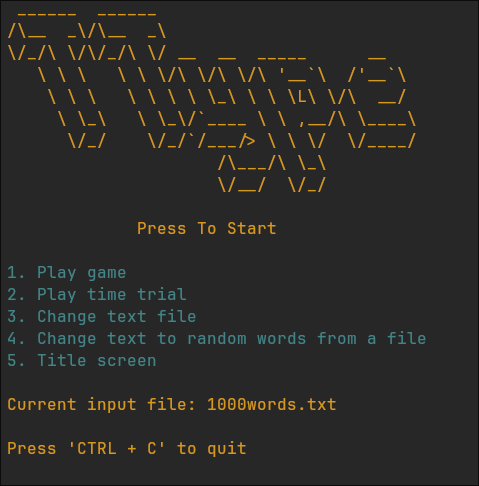
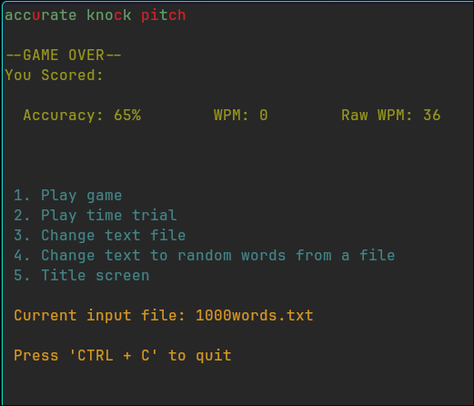

# TType - Rebuilt to be object-oriented

# About 
- my first large unguided project 
- very open to any advice
- can use any .txt file where:
    - file is in text directory
    - all text is on the first line of the file
      
# Notes
## Requirements
- nCurses library
- C++ compiler

## ToDo
- leaderboard

# Releases
## V1.7
- Words are re-randomised on game reset
- TimeTrial mode added

## V1.6
- New file selector
    * vim style keybinds
    * contents of text directory shown in program
- Improved start menu
    * less annoying

## V1.5
- select words in random order
    - same selection process as in order text
    - set to default mode

## V1.4
- Multithreaded the title page
    - flashing start button
        - slight delay at times due to the nature of the printing function

## V1.3
- Added colourscheme
    - Gruvbox
        - i dont really like it but its better than nothing
        - will change it/add more options
- Fixed WPM counter to start after first key press

## V1.2
- Score now shows raw WPM and accurate WPM
- Text files are now stored in "text" directory
- Added start button to title screen

## V1.1
- Added raw words per minute score
  - (total words/time)
  - regardless of accuracy
- Added line wrapping to avoid being cut in half for a new line(most of the time)
- changed title to require a specific key to be pressed to start the game
- Reformatted the score display

## V1.0
- first release
- rebuilt to be object/class based and have better modularity

# ScreenShots
### Title

### Changing file

### Playing/Score

